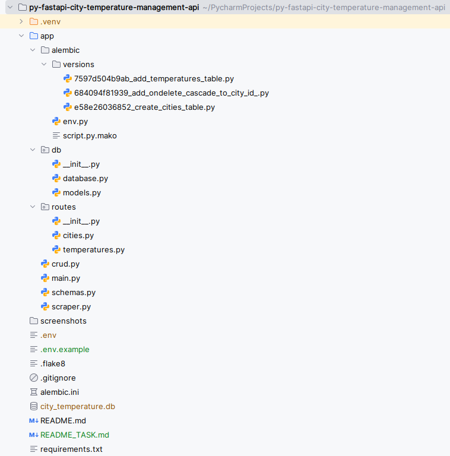
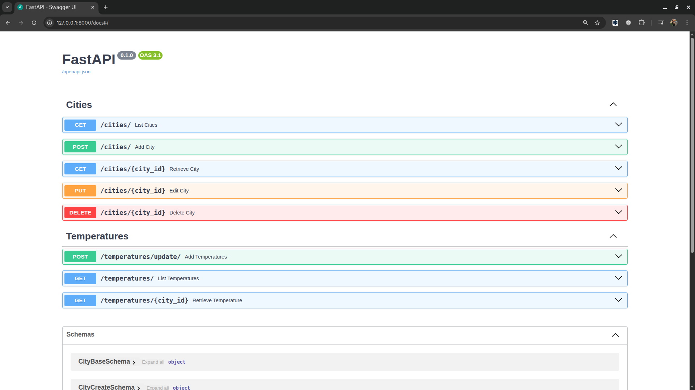

# 🌡️ City Temperature API

> **A FastAPI application for managing cities and tracking their temperature history.**

The project demonstrates the use of FastAPI, Async SQLAlchemy, and Alembic for building a modern async REST API.

## 🚀 Features

* ✅ Full CRUD API for managing cities

* ✅ Fetches current temperatures for all cities using an external API

* ✅ Stores temperature history in the database

* ✅ Provides endpoints to list historical temperature records

* ✅ Implemented with asynchronous SQLAlchemy (AsyncSession)

* ✅ Includes error handling and clean code structure

---

## 🎫 Design Choices

* **Async SQLAlchemy (AsyncSession)** — Non-blocking DB operations for scalability

* **APIRouter separation** — Clean project structure and modular endpoints

* **Alembic migrations** — For database schema versioning

---

## 🔎 Assumptions & Simplifications

* **SQLite** is used for simplicity; can be replaced with PostgreSQL for production

* External API used: **OpenWeatherMap**

* Temperatures are fetched in **Celsius** units

---

## 🌐 Endpoints Overview

### Cities CRUD
- **POST /cities/** — Create a new city

- **GET /cities/** — List all cities

- **GET /cities/{city_id}** — Get a city by ID

- **PUT /cities/{city_id}** — Update a city

- **DELETE /cities/{city_id}** — Delete a city

### Temperature API

- **POST /temperatures/** — Fetch and store current temperatures for all cities

- **GET /temperatures/** — Get the temperature history for all cities

- **GET /temperatures/{city_id}** — Get the temperature history for a specific city

---

## ⚙️ Installation & Running
1. **👥 Clone the repository**

```bash
git clone https://github.com/IhorDmytriv/py-fastapi-city-temperature-management-api.git
cd city-temperature-api
```

2. **⚠️ Create a `.env` file and add your environment variables (example)**

`
WEATHER_API_KEY=<API_KEY>
`

3. **🔐 Get a WEATHER API_KEY**

`
Get an API key from the OpenWeather API (https://openweathermap.org/) after signing in.
`
- Then put it in your .env file.

4. **📥 Create and activate virtual environment**

```bash
python -m venv venv
source venv/bin/activate      # Linux/Mac
venv\Scripts\activate         # Windows
```

5. **⚠️ Install dependencies**

```bash
pip install -r requirements.txt
```

6. **🧪 Run migrations**

```bash
alembic upgrade head
```

7. **🌐 Start the FastAPI server**

```bash
uvicorn app.main:app --reload
```

- Swagger API docs will be available at:

http://localhost:8000/docs

---

## 📊 Screenshots
* Project_Structure

* Swagger_UI


---

## 👨 Author

* Ihor Dmytriv
* Built during a FastAPI Framework course to practice backend web development

---

Feel free to contribute or fork the project!
